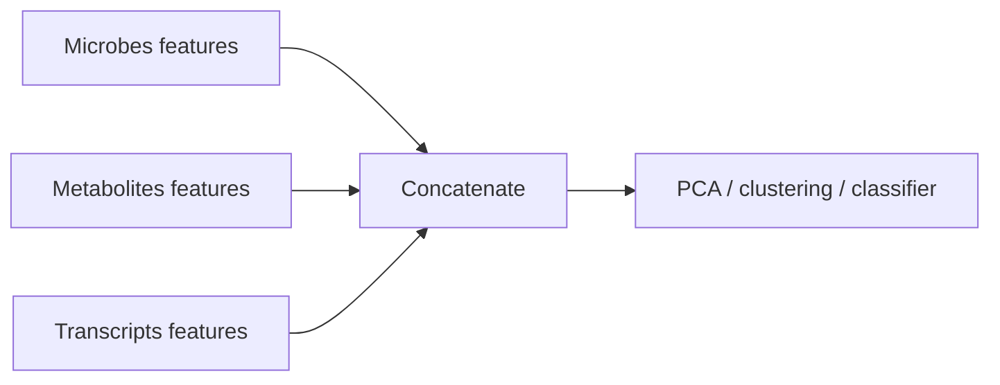
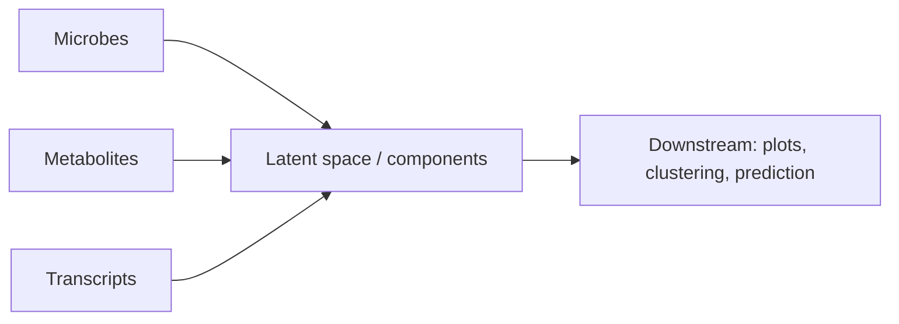

# Practical Multi-Omics Integration (DIABLO, DIVAS, VAEs + a few essentials)

A condensed-but-thorough, intuitive guide for people doing multi-omics (microbiome, metabolomics, transcriptomics, proteomics…) who want to integrate layers **without pretending correlation = causation**.

This repo covers:
- **DIABLO** (supervised latent components for classification + cross-omics feature selection)
- **DIVAS idea** (unsupervised shared-by-all vs shared-by-some vs unique structure)
- **Variational Autoencoders (VAEs)** for integration, including **adding group labels as categorical inputs**
- Other method families: **MOFA**, **JIVE**, **SNF**, **iCluster**, plus baselines **CCA/PLS/PCA**

We use the **same tiny toy example throughout** (4 patients, 3 omics blocks, 1 group label), and define every concept as we go.

## 0) Big picture: what “integration” can (and can’t) do

Integration can:
- Find **shared patterns** across omics (features co-vary)
- Find **subtypes** (unsupervised clustering/embeddings)
- Build **predictors** of a group/outcome using multiple omics (supervised)
- Suggest plausible **mechanistic chains** for follow-up (hypothesis generation)

Integration cannot:
- Prove **direction** (microbe → metabolite vs metabolite → microbe)
- Prove **causality** by itself (confounding can still explain patterns)
- Replace experimental design (randomization, perturbations, time ordering)

Useful mental model:
- Integration = pattern-finding + compression
- Causal inference = what happens if we intervene?

## Quickstart

Python:
- Inspect toy data: `python python/01_make_toy_data.py`
- Baseline early integration (concat + PCA): `python python/03_baseline_concat_pca.py`

Optional uv venv (nice for VS Code):
- `./scripts/uv_env.sh install-uv`
- `./scripts/uv_env.sh venv`
- `./scripts/uv_env.sh run python/03_baseline_concat_pca.py`

R:
- Inspect toy data: `Rscript r/01_make_toy_data.R`
- DIABLO mechanics demo: `Rscript r/02_diablo_mixomics_example.R` (requires `mixOmics`)

## 1) The toy example (same data used everywhere)

We have 4 patients. For each patient we measure:

- **Block 1: Microbiome** (4 bugs; compositional)
- **Block 2: Metabolomics** (3 metabolites)
- **Block 3: Transcriptomics** (3 genes)
- **Group label** (0/1) for supervised examples

Data file: `data/toy_multiomics_4patients.csv`

### Microbiome block

| Patient | Bug A | Bug B | Bug C | Bug D |
|---|---:|---:|---:|---:|
| P1 | 0.10 | 0.60 | 0.20 | 0.10 |
| P2 | 0.15 | 0.55 | 0.20 | 0.10 |
| P3 | 0.40 | 0.20 | 0.25 | 0.15 |
| P4 | 0.45 | 0.15 | 0.25 | 0.15 |

### Metabolomics block

| Patient | Met 1 | Met 2 | Met 3 |
|---|---:|---:|---:|
| P1 | 1.0 | 0.2 | 0.7 |
| P2 | 1.1 | 0.2 | 0.6 |
| P3 | 2.0 | 0.5 | 0.4 |
| P4 | 2.1 | 0.6 | 0.3 |

### Transcriptomics block

| Patient | Gene 1 | Gene 2 | Gene 3 |
|---|---:|---:|---:|
| P1 | 5.0 | 2.0 | 1.0 |
| P2 | 5.1 | 2.1 | 1.0 |
| P3 | 6.5 | 3.0 | 0.8 |
| P4 | 6.7 | 3.2 | 0.7 |

### Group label
- P1, P2 = **Group 0**
- P3, P4 = **Group 1**

## 2) Core vocabulary (no assumptions)

- **Block / view / modality**: one omics layer measured on the same samples.
- **Latent component / factor / embedding**: “one number per patient” summarizing a multi-feature pattern.
- **Supervised vs unsupervised**:
  - supervised uses a label/outcome (e.g. Group 0 vs 1)
  - unsupervised discovers structure without labels
- **Bias**: a systematically wrong conclusion that doesn’t go away with more data.
  - common causes here: batch effects, confounding, leakage

## 3) Three integration strategies (a simple map)

### Strategy A: Early integration (concatenate features)



Pros: simple.
Cons: scaling dominates; big blocks can drown small blocks.

### Strategy B: Intermediate integration (latent space integration)



DIABLO / DIVAS / MOFA / JIVE / multi-modal VAEs live here.

### Strategy C: Late integration (combine results)
Analyze each block separately, then combine predictions or similarities.
SNF often feels like this (fuse per-block similarity networks).

## 4) DIABLO (supervised integration)

DIABLO tries to find per-block components that:
- help separate the groups
- are correlated across blocks
- use only a subset of features (feature selection)

Read: `docs/02_diablo_supervised_integration.md`

## 5) DIVAS idea (shared-by-all vs shared-by-some vs unique)

The core concept: don’t assume every signal is shared across every block.

Read: `docs/03_divas_shared_some_unique.md`

## 6) VAEs for multi-omics integration

Key caution: if you feed the group label into the model (conditional VAE), separation may be partly “because you told it the label”.

Read: `docs/04_vae_multimodal_and_conditional.md`

## 7) Other conceptually important methods

Read: `docs/05_other_methods_mofa_jive_snf_icluster.md`

## 8) Choosing a method (what are you trying to do?)

| Goal | Supervised? | Good starting points | What you get |
|---|---:|---|---|
| Predict a group/outcome + pick cross-omics features | Yes | DIABLO | components + selected features + performance |
| Discover shared vs unique structure | No | DIVAS idea, JIVE, MOFA | factors/components labeled shared/unique |
| Patient subtyping via similarity | No | SNF | fused patient network + clusters |
| Integrative clustering | No | iClusterPlus | clusters + latent space |
| Nonlinear embedding / imputation | Maybe | multi-modal VAE | latent embedding + reconstructions |

## 9) Practical workflow (before any model)

1) Align samples across blocks (matching IDs)
2) Transform within each block (depends on data type)
3) Scale features (most methods are scale-sensitive)
4) Validate properly
   - supervised: cross-validation (nested CV if tuning)
   - unsupervised: stability checks (resampling)

## 10) How this helps you get “closer to causal”

Integration can suggest a chain like:
- Bug A ↔ Met 1 ↔ Gene 2 ↔ phenotype

…but that’s still correlation structure.
To get closer to causality you usually need:
- time ordering (longitudinal)
- perturbations (interventions)
- causal models on top of the hypotheses (with assumptions stated)

```mermaid
flowchart LR
  A[Multi-omics integration\n(DIABLO / DIVAS / MOFA / VAE)] --> B[Hypotheses:\nmodules & links]
  B --> C[Stronger evidence:\nperturbation, time, causal models]
  C --> D[Mechanistic claim\n(with assumptions stated)]
```

## Final honesty check
- “Integration” ≠ “causal”.
- “Nice separation in latent space” ≠ “biological truth”.
- Conclusions are only as good as preprocessing, validation, and confounding control.
